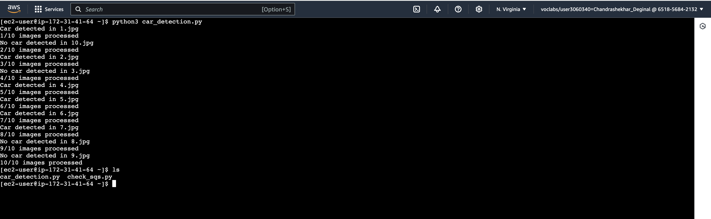
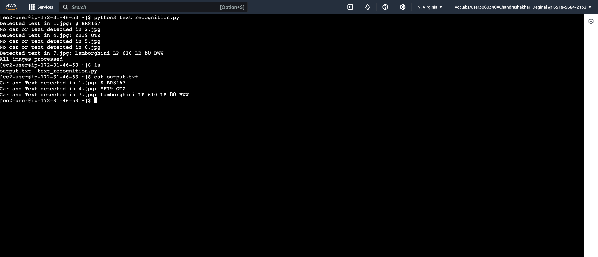

# AWS Image Recognition Pipeline with EC2, S3, SQS, and Rekognition
## Overview:
This project sets up an image recognition pipeline on AWS using two EC2 instances, S3, SQS, and AWS Rekognition. The pipeline processes images, detects cars in them using object detection, and recognizes any text present within the detected car images. The tasks are distributed across two EC2 instances running in parallel for efficient processing.

## Step-by-Step Instructions
### Step 1: Launch Two EC2 Instances
You need to launch two Amazon Linux EC2 instances that will work together—Instance A for car detection and Instance B for text recognition. Both instances should be in the same VPC for easy communication.
Open the AWS Management Console.
Navigate to EC2 Dashboard and click Launch Instance.
Select Amazon Linux AMI (HVM), SSD Volume Type and configure the instance details.
Ensure that both instances are in the same VPC.
Set appropriate security group rules to allow SSH access (port 22) and any necessary inbound/outbound traffic.
After launch, note down the Instance IDs and Public IPs.
### Step 2: Set Up the S3 Bucket
For this project, you’ll use an existing S3 bucket that contains the images you’ll process. The bucket URL is:

### S3 Bucket URL: https://njit-cs-643.s3.us-east-1.amazonaws.com

This bucket has 10 images, which will be downloaded by Instance A for car detection.

### Step 3: Create an SQS Queue
You will create an SQS queue to facilitate communication between the two EC2 instances.

In the AWS Management Console, navigate to SQS.
Create a new queue (e.g., my-cloud-queue), ensuring that it is in the same region as the EC2 instances.
Note down the SQS Queue URL for use in the application.
### Step 4: Configure AWS Credentials
To allow both EC2 instances to interact with AWS services (S3, SQS, Rekognition), you need to configure AWS credentials.

SSH into both EC2 instances using your key pair:
ssh -i 'your-key.pem' ec2-user@your-ec2-public-ip

On both instances, create the ~/.aws/credentials file to store the AWS credentials:
nano ~/.aws/credentials

Add the following content (use the AWS credentials provided by Vocareum):
[default]
aws_access_key_id = <Your_Access_Key_ID>
aws_secret_access_key = <Your_Secret_Access_Key>
aws_session_token = <Your_Session_Token>

Save the file and test your credentials by listing the contents of the S3 bucket:
aws s3 ls

### Step 5: Install Dependencies on Both EC2 Instances
Before writing the scripts, you need to install some dependencies, including Python, pip, and Boto3 (AWS SDK for Python).

Run the following commands on both instances to update and install necessary packages:
sudo yum update -y
sudo yum install python3 -y
sudo yum install python3-pip -y
pip3 install boto3

### Step 6: Object Detection Code (Instance A)
On Instance A, create a Python script that:
Connects to the S3 bucket to download images.
Uses AWS Rekognition to detect objects in the images.
If a car is detected with a confidence level of 90% or higher, sends the image index (e.g., image1.jpg) to the SQS queue.
Adds a signal -1 to the SQS queue when all images are processed to inform Instance B that the process is complete.

To Run the Script:
python3 car_detection.py
Once you run this, check the SQS Dashboard to verify that messages are appearing in the queue.

### Step 7: Text Recognition Code (Instance B)
On Instance B, write a Python script that:
Polls the SQS queue for messages (image indices).
Downloads each image from S3 based on the index received.
Uses AWS Rekognition to perform text recognition on the images.
Logs the image index and any detected text to an output file (output.txt).
Terminates when it receives the -1 signal.

To Run the Script:
python3 text_recognition.py

### Step 8: Running the Application
Run Instance A:
Execute the car detection script (car_detection.py) on Instance A. This will start processing the images from S3 and send messages to the SQS queue.
Check the SQS Dashboard to see the messages as they are added.

Run Instance B:
Simultaneously or after some delay, execute the text recognition script (text_recognition.py) on Instance B. This will download images from S3, detect any text, and save the results to output.txt.

### Sample Outputs:
Instance A Output: Image indices where cars are detected.

Instance B Output (output.txt): Image indices along with detected text in images that contain both cars and text.

