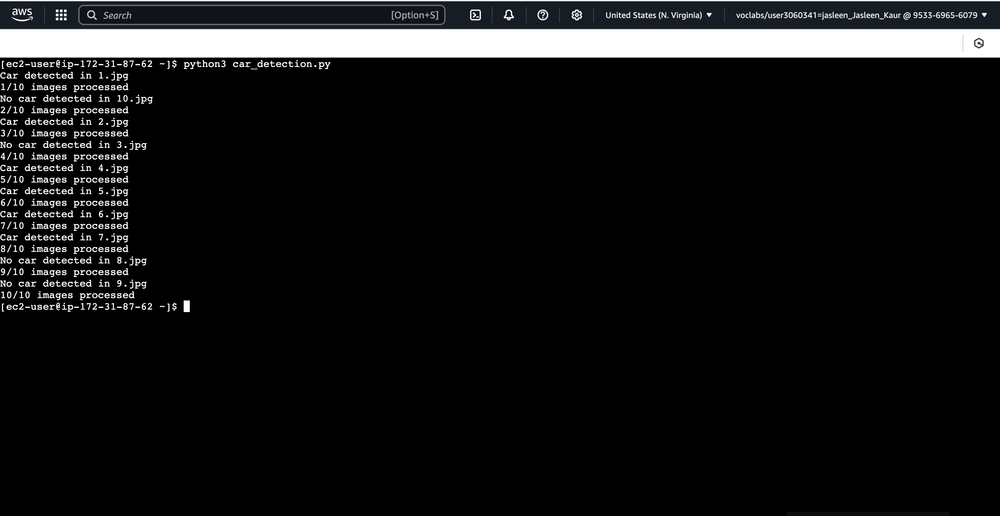
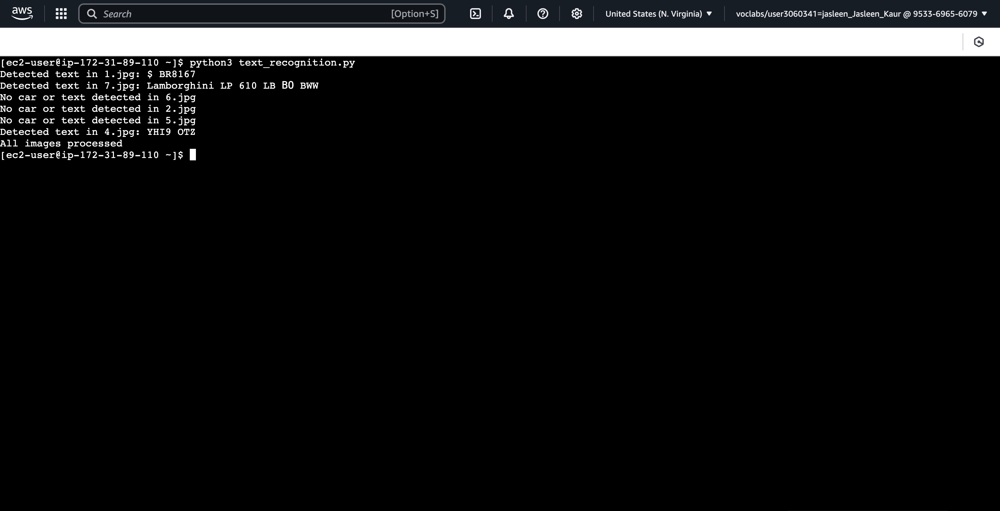

# AWS Image Recognition Pipeline with EC2, S3, SQS, and Rekognition
## Overview:
This project establishes an image recognition pipeline on AWS using two EC2 instances, S3, SQS, and AWS Rekognition. The pipeline processes images to detect cars and recognize any text within the identified car images. Tasks are distributed between two EC2 instances operating in parallel for efficient execution.

## Step-by-Step Instructions
### Step 1: Launch Two EC2 Instances
Deploy two Amazon Linux EC2 instances—Instance A for car detection and Instance B for text recognition. Both instances should reside within the same VPC for seamless communication.

- Access the AWS Management Console.
- Navigate to the EC2 Dashboard and select "Launch Instance."
- Choose the Amazon Linux AMI (HVM) with SSD Volume Type and configure the instance settings.
- Ensure that both instances are in the same VPC.
- Adjust security group rules to permit SSH access (port 22) and other necessary inbound/outbound traffic.
- Upon launching, note down the Instance IDs and Public IP addresses.

### Step 2: Configure the S3 Bucket
The project utilizes an existing S3 bucket that contains the images for processing. The bucket URL is:

### S3 Bucket URL: [https://njit-cs-643.s3.us-east-1.amazonaws.com](https://njit-cs-643.s3.us-east-1.amazonaws.com)

This bucket includes 10 images that Instance A will process for car detection.

### Step 3: Create an SQS Queue
An SQS queue is required for communication between the two EC2 instances.

- In the AWS Management Console, go to the SQS service.
- Create a new queue (e.g., my-cloud-queue), ensuring it is in the same region as the EC2 instances.
- Save the SQS Queue URL for later use in the scripts.

### Step 4: Set Up AWS Credentials
Both EC2 instances need AWS credentials to interact with S3, SQS, and Rekognition.

- SSH into each EC2 instance using your key pair:
  ```sh
  ssh -i 'your-key.pem' ec2-user@your-ec2-public-ip
  ```
- On each instance, create the AWS credentials file:
  ```sh
  nano ~/.aws/credentials
  ```
- Insert the following credentials (replace with those provided by Vocareum):
  ```ini
  [default]
  aws_access_key_id = <Your_Access_Key_ID>
  aws_secret_access_key = <Your_Secret_Access_Key>
  aws_session_token = <Your_Session_Token>
  ```
- Save the file and verify access by listing the S3 bucket contents:
  ```sh
  aws s3 ls
  ```

### Step 5: Install Required Dependencies
Before scripting, install essential dependencies like Python, pip, and Boto3.

- Run the following commands on both EC2 instances:
  ```sh
  sudo yum update -y
  sudo yum install python3 -y
  sudo yum install python3-pip -y
  pip3 install boto3
  ```

### Step 6: Implement Car Detection on Instance A
On Instance A, create a Python script that:

- Connects to the S3 bucket to fetch images.
- Utilizes AWS Rekognition for object detection.
- If a car is detected with at least 90% confidence, sends the image index (e.g., image1.jpg) to the SQS queue.
- Sends a termination signal (-1) to the queue when all images are processed, indicating completion.

To execute the script:
```sh
python3 car_detection.py
```
Verify the messages in the SQS queue using the AWS SQS Dashboard.

### Step 7: Implement Text Recognition on Instance B
On Instance B, create a Python script that:

- Polls the SQS queue for image indices.
- Retrieves corresponding images from S3.
- Uses AWS Rekognition for text detection.
- Logs the image index along with recognized text to an output file (output.txt).
- Stops execution upon receiving the termination signal (-1).

To execute the script:
```sh
python3 text_recognition.py
```

### Step 8: Execute the Pipeline
#### Running Instance A:
- Start the car detection script (car_detection.py) on Instance A. This script processes the S3 images and sends messages to the SQS queue.
- Monitor the SQS Dashboard to track messages being added.

#### Running Instance B:
- Run the text recognition script (text_recognition.py) on Instance B either simultaneously or after some delay.
- The script will fetch images from S3, identify text, and store the results in output.txt.

### Sample Outputs:
#### Instance A Output: Image indices where cars are detected.



#### Instance B Output (output.txt): Image indices along with detected text in images containing cars and text.


